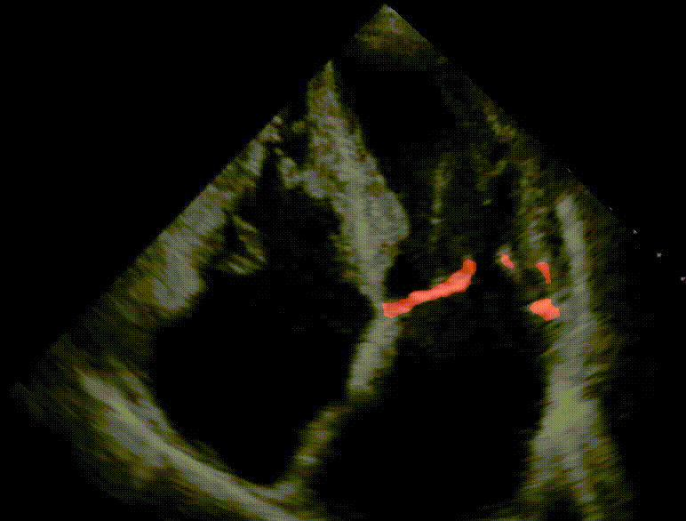

<div align="center">
  
# Mitral Valve Segmentation

</div>

This project is a classical segmentation task where we segment a mitral valve in the heart using a U-Net model.

## Overview

The main goal of this project is to perform semantic segmentation on medical images to identify the mitral valve. The project uses a U-Net, a convolutional neural network architecture designed for fast and precise segmentation of images. The model is trained on a dataset of images and their corresponding masks and then used to predict segmentation on unseen test data.

## Dataset

The dataset is provided in two `.pkl` files: `train.pkl` and `test.pkl`.

- **`train.pkl`**: This file contains the training data, which includes a set of images and their corresponding ground truth segmentation masks.
- **`test.pkl`**: This file contains the test data, which consists of video frames without segmentation masks.

The training data (train.pkl) is a list of dictionaries containing the following keys: name, video, box, label, frames, dataset. A single dictionary has the following structure:

```python
{
    'name': 'AC8ASN45B9',  # Unique identifier for the video
    'video': array([...], dtype='uint8'),     # Array of video frames (grayscale images)
    'box': array([...], dtype='bool'),       # Bounding box coordinates for the mitral valve in each frame
    'label': array([...], dtype='bool'),     # Ground truth segmentation masks for the mitral valve
    'frames': [41, 65, 167],         # Number of frames in the video
    'dataset': 'amateur'     # Indicates that this is training data
}
```

The shape of the video is (height, width, number of frames), the box has shape (height, width) and the label has the same shape as the video. The frames is a list of indices (starting at zero), indicating which frames are labeled. The dataset key describes if the video was labeled by amateurs or experts.

The test set file (test.pkl) has the same structure but with the labels removed.

## How to run the project

1.  **Clone the repository:**

    ```bash
    git clone https://github.com/afonsofsdomingues/mv-segmentation.git
    cd mv-segmentation
    ```

2.  **Create a Python environment:**
    It is recommended to use a virtual environment to manage the project's dependencies.

    - On macOS and Linux:
      ```bash
      python3 -m venv venv
      source venv/bin/activate
      ```
    - On Windows:
      ```bash
      python -m venv venv
      .\venv\Scripts\activate
      ```

3.  **Install dependencies:**
    Install the required packages using the `requirements.txt` file.

    ```bash
    pip install -r requirements.txt
    ```

4.  **Run the Jupyter Notebook:**
    The main workflow of the project is detailed in the `mv_segmentation.ipynb` notebook. You can run the cells in the notebook to see the data loading, preprocessing, model training, evaluation, and submission generation process.

    (Note: The weights of the model are saved in a .pth file in the models directory to prevent having to retrain the model.)

## Results

Here are three examples of the model's segmentation performance on test videos:





## Folder Structure

```
.
├── demo/                   # Directory for storing demo images and GIFs.
├── models/                 # Directory for storing trained model weights.
│   ├── U_Net_best.pth
│   └── U_Net_best_og.pth
├── output_videos/          # Directory for storing output videos with predicted segmentations.
├── data_loader.py          # Scripts for loading and preparing data for the model.
├── mv_segmentation.ipynb   # Main Jupyter Notebook with the complete workflow.
├── README.md               # This file.
├── requirements.txt        # A list of Python packages required to run the project.
├── test.pkl                # The test dataset.
├── train.pkl               # The training dataset.
├── trainer.py              # The training script for the U-Net model.
├── transforms.py           # Scripts for data augmentation and transformations.
├── unet.py                 # The U-Net model architecture.
└── utils.py                # Utility functions for visualization, preprocessing, etc.
```
